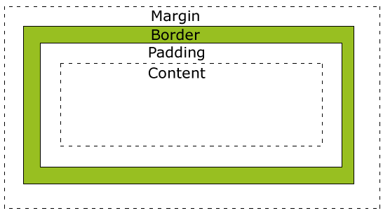

## 第三节 盒子模型

 

 >  Margin(边距) - 清除边框外的区域，外边距是透明的。
 >  Border(边框) - 围绕在内边距和内容外的边框。
 >  Padding(补白) - 清除内容周围的区域，内边距是透明的。
 >  Content(内容) - 盒子的内容，显示文本和图像
 >  注意：模型盒子中边框、内容、补白只能为正值，边距可以去负值

###  css盒子的宽、高：

1.  总元素的宽度=宽度+左填充+右填充+左边框+右边框+左边距+右边距

2.  总元素的高度=高度+顶部填充+底部填充+上边框+下边框+上边距+下边距

###  标准文本流

>  行内元素(内联元素)左右排列：a img input button span    
   快级元素占整行，从上到下: h1-h6 p div ul ol li dd dt

###  css行内元素的模型盒

1.  能设置边框、补白

2.  可以设置左右边距，上下边距设置无效。(可转换为块级元素来设置)

###  盒子相关属性

1.  display: inline/ block/ inline-block

>   决定了一个元素是快级元素还是行内元素

2.  border: 1px solid #ccc

>   边框属性
    border-width： top right bottom left     
    border-style:  solid/ dotted/ double  
    border-color： #ccc/ red/ rgb(128,128,128)

3.  margin: 只能设置width

>   边距属性  
    margin: top right bottom left
    上下相邻的两个盒子边距合并：
    监视边距按照大的边距为准

>   设置自动居中
    margin:  0  auto

4.  padding：只能设置width   

>   补白属性
    padding: top right bottom left

5.  border-radius： 设置边框的圆角

6.  outline：轮廓，和border一样可以设置width/ style/ color    

    书写：
>   border-width/ padding/ margin : 10px 5px 4px 3px    
                                     上   右  下  左
    border-width/ padding/ margin : 10px   5px   4px     
                                     上   右、左  下
    border-width/ padding/ margin : 10px    5px        
                                   上、下  右、左  
    border-width/ padding/ margin :    10px
                                   上、下、左、右                                   

###  css3盒子模型

>   CSS3的盒子模型 box-sizing:
		content-box: 盒子大小(宽高)不包括padding和border
		border-box:  盒子大小(宽高)包括padding和border

>  box-sizing: content-box;    外加模式,添加padding和border盒子会变大  
	 box-sizing: border-box;     内减模式,添加padding和border盒子可放内容会变小

  [css盒子模型和css3盒子模型参考文档](https://blog.csdn.net/diligentkong/article/details/61617761)
